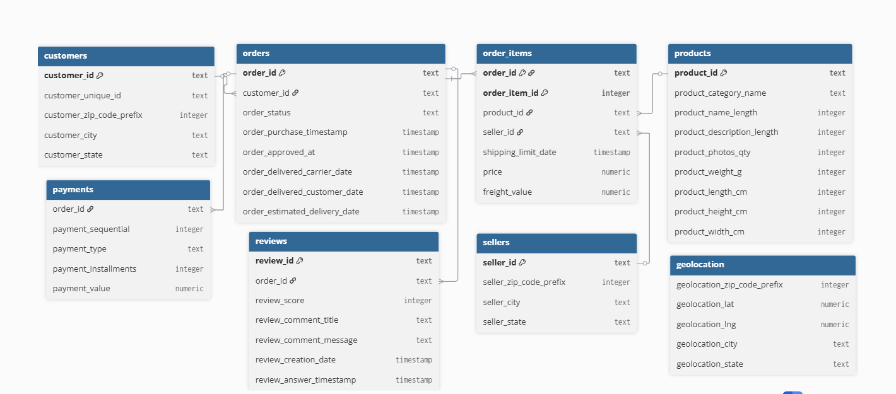

# UrbanCart Insights

## Company Overview
UrbanCart is an e-commerce retailer specializing in a variety of products.  
As a data analyst at UrbanCart, I analyze sales pipeline data to understand performance across accounts, products, and sales teams.

## Project Description
This project focuses on building a relational database in PostgreSQL to store and analyze UrbanCart’s sales data.  
The goal is to prepare the data for advanced visualization and analytics in later stages.

## Database Schema
The database contains the following tables:
- **accounts**: company accounts and sectors
- **products**: product catalog with pricing
- **sales_teams**: agents, managers, and regional offices
- **sales_pipeline**: sales opportunities linked to accounts, products, and agents
- **data_dictionary**: descriptions of fields in the dataset

_Example schema diagram (to be added later)._

## Setup Instructions
1. Install **PostgreSQL** (v17 recommended).
2. Create a database called `urbancart`.
3. Run the provided `schema.sql` file to create tables.
4. Use `\copy` in `psql` to load CSVs into the tables (see `import_instructions.sql`).
5. Verify the data with sample queries in the `queries/` folder.

## Tools & Resources
- PostgreSQL 17
- Maven Analytics Sales CRM dataset
- Windows PowerShell + psql client

## Sample Output

